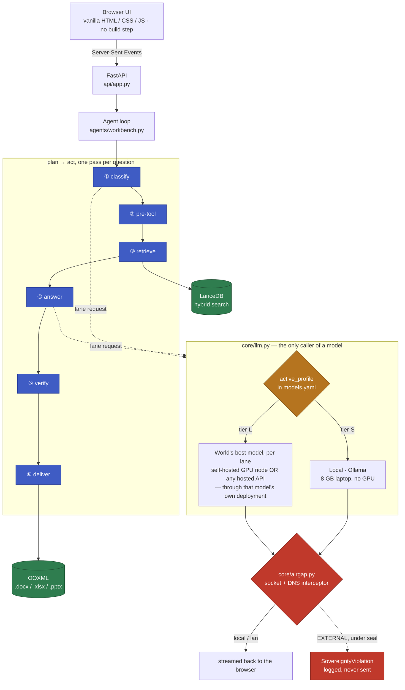
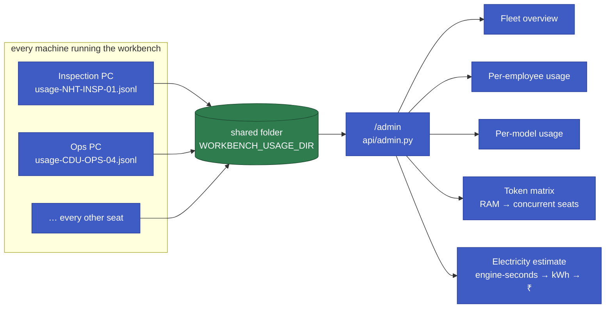

# Sovereign Workbench

An on-premise AI workbench for **refining and petrochemicals**. It reads
inspection reports, test certificates, procedures, shift logs and P&ID sheets,
answers with citations, and produces real Word / Excel / PowerPoint
deliverables — with **zero external network calls**, enforced at the socket
layer rather than promised in a slide.

It runs on a laptop. It also scales to a GPU node by changing one line.

Everything in it is built for this sector specifically: ISA 5.1 tag
conventions, API 510 thickness and corrosion-rate work, relief-device set
pressure verification, isolation and HAZOP traceability, and the
superseded-revision and deviation-approval traps that decide whether a plant
answer is right or dangerous.

```bash
./start.sh          # → http://127.0.0.1:8000
```

### At a glance

What we built, in one place — the full breakdown with method and caveats is
in [Measured results](#measured-results) further down.

| | |
|---|---|
| **Symbol detection**, 496 annotated P&ID symbols | **81.7%** located · 76.4% correct class · F1 **0.770** |
| **Tag reading** (OCR), 433 symbols | **86.8%** |
| **Capability suite** — retrieval, refusal, air-gap, deliverables, P&ID | **9 / 9** |
| **Industry trap suite** — superseded revisions, deviation approvals, missing surveys | **17 / 18** |
| **External network calls, ever** | **0**, enforced at the socket layer |
| **Runs on** | an 8 GB laptop with no GPU, today — scales to a GPU node or a hosted API by changing one line |

**Feature set:** cited Q&A over your own documents (`[1]` → exact passage,
file, page) · real `.docx` / `.xlsx` / `.pptx` deliverables, not chat replies
· `.pdf .docx .pptx .xlsx .csv .md .html .txt .png .jpg .tiff .bmp .webp`,
including OCR on scans and handwriting · P&ID drawings turned into a
connectivity graph — symbol detection, tag reading, line tracing, all
deterministic, never shown to a language model · a live activity feed that
names which model answered and why · Python-executed arithmetic for anything
that has to be calculated, not guessed · a per-organisation
[fleet dashboard](#fleet--the-admin-dashboard) for token usage, model mix, RAM
capacity and an on-prem electricity estimate.

---

## Contents

- [The problem it solves](#the-problem-it-solves)
- [Getting started](#getting-started)
- [How a question flows through the system](#how-a-question-flows-through-the-system)
- [The two tiers](#the-two-tiers)
- [Fleet — the admin dashboard](#fleet--the-admin-dashboard)
- [Engineering drawings (P&ID)](#engineering-drawings-pid)
- [Why it cannot call out](#why-it-cannot-call-out)
- [Repository layout](#repository-layout)
- [Measured results](#measured-results)
- [Things we got wrong, and what they taught us](#things-we-got-wrong-and-what-they-taught-us)

---

## The problem it solves

A refinery or petrochemical complex keeps its knowledge in inspection reports,
scanned certificates, handwritten shift logs, superseded procedures and P&ID
sheets. Answering one ordinary question — *"can PSV-7301 stay in service?"* —
means reading a shop test certificate, the **current** revision of a procedure,
a deviation approval that may or may not cover this device, and the drawing
that shows what it protects.

Get any one of those wrong and the answer is not merely unhelpful. Clearing a
non-conforming relief device, or condemning a conforming one, both have a cost
on the unit.

None of it can go to a cloud assistant. It is commercially confidential, and
much of it is safety-critical.

So the workbench runs entirely on the customer's own hardware:

**Ask questions about your documents.** Every claim carries a `[1]` citation
you can click to see the exact passage, file and page. If the record does not
contain the answer, it says so instead of inventing one.

**Get files, not chat replies.** Ask for "an approval note as a Word file" and
a `.docx` lands on disk — findings with citations, a measurements table, a
decision, a sign-off block, and a Sources page.

**Read almost anything.** `.pdf .docx .pptx .xlsx .csv .md .html .txt .png
.jpg .tiff .bmp .webp` — including image-only PDFs and handwritten notes,
OCR'd locally.

**Understand drawings, not just text.** A P&ID is turned into a connectivity
graph, so *"what must be closed to isolate V-7101?"* is answered by walking the
pipework, not by guessing.

**Show its work.** A live activity feed names each phase as it happens: which
model was selected and why, how many passages cleared the relevance threshold,
what was written.

**Run code when a number needs calculating.** Short Python, executed in a
sandbox with no network, so a corrosion rate is computed rather than
hallucinated.

---

## Getting started

### Install — the only step that needs a network

```
  ┌──────────────────────────────────────────────────────────┐
  │  ONE-TIME SETUP  (build machine, network required)       │
  │                                                          │
  │   1. Ollama + model weights            ~5 GB             │
  │   2. Python dependencies               ~2 GB             │
  │   3. docling layout + OCR weights      ~1.3 GB           │
  │   4. Build and index a corpus                            │
  └──────────────────────────────────────────────────────────┘
                              │
                     ╔════════▼════════╗
                     ║  PULL THE CABLE ║
                     ╚════════╤════════╝
                              │
  ┌───────────────────────────▼──────────────────────────────┐
  │  FROM HERE ON: ./start.sh, offline, forever              │
  └──────────────────────────────────────────────────────────┘
```

```bash
# 1. Engine and models
brew install ollama && ollama serve &
ollama pull qwen3.5:0.8b        # router
ollama pull qwen3.5:4b          # reason · code · vision
ollama pull nomic-embed-text    # embeddings

# 2. Python
python3.11 -m venv .venv
./.venv/bin/pip install -r backend/requirements.txt

# 3. Cache docling's layout + OCR weights while still online
cd backend && ../.venv/bin/python -c \
  "from docling.utils.model_downloader import download_models; download_models()"

# 4. A demo corpus, indexed
../.venv/bin/python -m tools.make_corpus --clean
../.venv/bin/python -m ingest.pipeline build --rebuild
```

### Run

```bash
./start.sh        # checks Ollama, reindexes changed files, serves on :8000
```

`start.sh` is the whole operating procedure. It verifies the engine is up,
reports which models are missing rather than failing obscurely, indexes
anything new, and serves the UI.

### Day-to-day commands

```bash
cd backend
../.venv/bin/python -m core.llm                      # lane self-test + timings
../.venv/bin/python -m ingest.pipeline build         # index new/changed only
../.venv/bin/python -m ingest.pipeline search "shell thickness"
../.venv/bin/python -m ingest.pipeline status
```

### Benchmarks

```bash
../.venv/bin/python -m bench.run_benchmark      # 9 capability tests
../.venv/bin/python -m bench.run_industry       # 18 industry questions
../.venv/bin/python -m bench.run_pid_bench      # P&ID detection
../.venv/bin/python -m bench.run_pid_bench --no-tile    # the control run
```

---

## How a question flows through the system



*Deterministic code does stages ①②③⑤⑥ — detection, retrieval, arithmetic and
file-writing never touch a model. Only ④ (and the classification inside ①)
calls one, and always through the lane router, never by name. The block below
is the same flow spelled out for readers whose renderer does not draw the
diagram above.*

```
   ┌────────────┐
   │  browser   │   vanilla HTML/CSS/JS · no npm · no CDN · no build step
   └─────┬──────┘
         │  Server-Sent Events  (step · route · sources · token · file · done)
   ┌─────▼────────────────────────────────────────────────────────────┐
   │  api/app.py          FastAPI · SSE bridge · uploads · downloads  │
   └─────┬────────────────────────────────────────────────────────────┘
         │
   ┌─────▼────────────────────────────────────────────────────────────┐
   │  agents/workbench.py — the plan/act loop                         │
   └─────┬────────────────────────────────────────────────────────────┘
         │
         │  ① CLASSIFY  ─────────────────────────────────────────────┐
         │     router lane decides the class from few-shot examples  │
         │     defined in models.yaml — not in code                  │
         │     document · reason · code · pid · compare · chitchat   │
         │                                                           │
         │  ② PRE-TOOL  ─────────────────────────────────────────────┤
         │     deterministic work BEFORE any model sees the question │
         │     analyze_pid · extract_actions · compare_docs          │
         │                                                           │
         │  ③ RETRIEVE  ─────────────────────────────────────────────┤
         │     hybrid search over LanceDB, tag-boosted,              │
         │     0.50 relevance floor, skipped entirely for chitchat   │
         │                                                           │
         │  ④ ANSWER  ───────────────────────────────────────────────┤
         │     reason lane, grounded prompt, citations required      │
         │     for plant facts and forbidden for general knowledge   │
         │                                                           │
         │  ⑤ VERIFY  ───────────────────────────────────────────────┤
         │     arithmetic and tolerance bands checked by regex,      │
         │     not by asking the model to grade itself               │
         │                                                           │
         │  ⑥ DELIVER  ──────────────────────────────────────────────┘
         │     model returns structured JSON → Python renders OOXML
         ▼
   ┌──────────────────────────────────────────────────────────────────┐
   │  core/llm.py          lane router — the only caller of a model   │
   │  ingest/pipeline.py   docling → chunks → embeddings → LanceDB    │
   │  tools/               deliverables · sandbox · verify · pid      │
   │  core/airgap.py       socket + DNS interceptor                   │
   └─────┬────────────────────────────────────────────────────────────┘
         │  localhost only
   ┌─────▼──────────────────────────────────────────────────────────┐
   │  Ollama  (or vLLM on a GPU node — same interface)              │
   └────────────────────────────────────────────────────────────────┘
```

### Two ideas hold the design together

**Callers ask for a lane, never a model.** `router`, `reason`, `code`,
`vision`, `embed`. `models.yaml` decides which model serves each lane. Adding a
new open-weight model is six lines of YAML and no code change — which is why
the laptop tier and the GPU tier share one codebase.

**Deterministic work never goes through a model.** Symbol detection, line
tracing, graph traversal, table extraction, document diffing, arithmetic
checking and OOXML writing are all ordinary code. The model's job is to select,
read and explain — never to count, calculate or format. A model that is not
allowed to invent a number cannot invent one.

---

## The two tiers

There are exactly two. The same code runs on both — `active_profile:` in
`models.yaml` is the only difference.

It ships on an 8 GB laptop with no GPU and no network, and **it scales all the
way to the largest open-weight models in the world** — glm-5.3, deepseek-v4-pro,
qwen3-vl:235b — without a line of code changing. One deployment story covers a
site engineer's laptop and a datacentre node.

> **tier-L is not one fixed model list — it is "point every lane at whichever
> model is best right now, through that model's own deployment."** That
> deployment can be a self-hosted GPU node running the current best
> open-weight release, or it can be a hosted API from any frontier lab —
> whichever the organisation already trusts and has commercial terms with.
> Swapping either is six lines of YAML (`endpoint` + `api_key_env` per lane in
> `models.yaml`), never a code change. The table below shows the self-hosted
> shape; [tier-L over a hosted API](#a-hosted-api-shape-of-tier-l) further
> down shows the other one, already wired and running.

```
         runs here today                              scales to this
                  │                                          │
                  ▼                                          ▼
  TIER-S — the low-end target                TIER-L — the strongest open weights
  ┌───────────────────────────────┐          ┌───────────────────────────────┐
  │ 8 GB laptop · no GPU          │          │ 8x H200 class node            │
  │ MacBook Air M1 · no internet  │          │ vLLM, OpenAI-compatible       │
  ├───────────────────────────────┤          ├───────────────────────────────┤
  │ router  qwen3.5:0.8b          │          │ router  qwen3.5:2b            │
  │ reason  qwen3.5:4b            │ ───────► │ reason  glm-5.3        think  │
  │ code    qwen3.5:4b            │          │ code    deepseek-v4-pro       │
  │ vision  qwen3.5:4b            │          │ vision  qwen3-vl:235b-a22b    │
  │ embed   nomic-embed-text      │          │ embed   qwen3-embedding:8b    │
  ├───────────────────────────────┤          ├───────────────────────────────┤
  │ max_loaded_models: 1          │          │ max_loaded_models: 4          │
  │ models hot-swap (~2 s)        │          │ all resident                  │
  └───────────────────────────────┘          └───────────────────────────────┘
     ~22 s per answer                           falls back to tier-S if the
     EVERY NUMBER IN THIS REPO                  node does not answer in 2 s
     WAS MEASURED HERE                          NOTHING HERE HAS BEEN RUN

         └────────────────── same code · same lanes · same prompts ──────────┘
                    only active_profile: in models.yaml differs
```

**8 GB is the floor the product is designed against, not a compromise.** It is
the machine an inspection engineer already has, and it is where every benchmark
in this repository was run. `max_loaded_models: 1` is what makes it work:
models hot-swap rather than coexist, and the swap measures ~2 s against a ~20 s
answer.

### tier-L is the largest open weights that exist, per lane

| lane | model | size | license | why |
|---|---|---|---|---|
| reason | **glm-5.3** | ~753B | MIT | top open-weight entry on the Artificial Analysis intelligence index (45, Sept 2026), ahead of kimi-k3 on 44 |
| code | **deepseek-v4-pro** | 1.6T MoE | MIT | 80.6% SWE-bench Verified |
| vision | **qwen3-vl:235b-a22b** | 235B-A22B | Apache-2.0 | flagship open VLM, 256K context, rivals Gemini-2.5-Pro on multimodal benchmarks |
| embed | **qwen3-embedding:8b** | 8B | Apache-2.0 | MTEB ~70.6, the largest in its family |
| router | qwen3.5:2b | 2B | Apache-2.0 | **deliberately not maximised — see below** |

`kimi-k3` (2.8T, the largest open weight released) is a drop-in alternative on
the reason lane if you have 8× B300. At INT4 (~370–390 GB) glm-5.3 fits 8× H100
or 4× H200; the FP8 release (~755 GB) needs 8× H200.

**Two honest notes on this table.**

*Nothing in it has been run.* tier-S is measured; tier-L is a configuration. It
is written down because it is the proof that "a new open-weight model is
addable without redesigning the system" is demonstrable rather than claimed —
lane names, event stream, prompts and every tool are byte-identical between the
two profiles. Only the block changes.

*It will be out of date.* Open-weight leadership changed hands three times in
2026. That is the argument **for** the lane abstraction, not against it: when
the next one lands, it is six lines of YAML and no code anywhere.

### A hosted-API shape of tier-L

The table above is one shape of tier-L — a GPU node you own, running open
weights, never run in this repo because there is no such node on hand. The
other shape needs no hardware at all: point individual lanes at a vendor's
hosted API instead of a local engine, and let *their* deployment carry the
weight.

`Lane` in `core/llm.py` carries its own `endpoint` and `api_key_env`, so a
single `tier-L` profile can mix vendors — one lane can run against a hosted
frontier model while another stays local:

```yaml
tier-L:
  endpoint: https://api.deepseek.com
  api_key_env: TIER_L_API_KEY
  lanes:
    router:  { model: deepseek-flash,  think: false, max_tokens: 32 }
    reason:  { model: deepseek-v4-pro, think: true, reasoning_effort: max }
    code:    { model: deepseek-v4-pro, think: false }
    vision:
      model: gemini-3.5-flash            # a different vendor, same lane shape
      endpoint: https://generativelanguage.googleapis.com/v1beta/openai
      api_key_env: GEMINI_API_KEY
    embed:   { model: nomic-embed-text, dim: 768 }   # stays local — no vendor
                                                       # embeds a 768-d vector
                                                       # any faster than a
                                                       # network round trip
```

No key ever lives in this file or is committed — `api_key_env` **names** an
environment variable; the value goes only in a gitignored `.env`. The keys
never travel outside the process either: an API-backed lane is still one more
`endpoint` behind `core/airgap.py`'s classifier, so it is logged as an
EXTERNAL call and only reachable at all when `SOVEREIGN_MODE=audit` is set —
`seal()`, the default, blocks it at the socket the same as it would block
anything else leaving the machine. Choosing a hosted lane is a deliberate,
visible, revocable decision, not a default.

This is the shape that has actually been exercised end-to-end in this
project — real requests, real answers, on documents the router had never
seen — while the self-hosted table above waits for a node. Neither shape
needed a code change to reach; both are `active_profile: tier-L` and a
different block underneath it.

### Why the router is the one lane we did not maximise

The router emits 32 tokens of JSON to pick a lane. On tier-S, few-shot examples
took a 0.8b model from 83% to **100%** on a held-out set — the accuracy came
from the examples, not the parameters. Putting a trillion-parameter model on a
classification a 2b model already gets right would add latency to every single
request for nothing.

The same logic caps the vision lane's job. `qwen3-vl:235b-a22b` is a far better
model than anything on the laptop, and it still does not **count** symbols on a
drawing — `tools/pid_ocr.py` does, deterministically. Scale changes which model
explains best; it does not change which component should be trusted to
enumerate.

### What a 24 GB laptop changes

Between the two tiers sits the machine most engineering teams actually buy. It
does not get its own profile — it runs `tier-L` with two lanes stepped down.

| lane | tier-S (8 GB) | 24 GB laptop | tier-L (8× H200) |
|---|---|---|---|
| router | qwen3.5:0.8b | qwen3.5:2b | qwen3.5:2b |
| reason | qwen3.5:4b | **qwen3.5:9b** | glm-5.3 + think |
| code | qwen3.5:4b | qwen3.5:9b | deepseek-v4-pro |
| vision | qwen3.5:4b | **qwen3-vl:8b** | qwen3-vl:235b-a22b |
| embed | nomic-embed-text | **qwen3-embedding:8b** | qwen3-embedding:8b |
| resident | 1 (hot-swap) | 2 | 4 |

The three bold rows are the upgrades that matter, and 24 GB is the first point
at which they fit together: a ~5 GB vision model beside a ~5 GB embedding model
beside a 9b reason model. Nothing in the tier-L column is reachable from here —
the smallest of those weights is an order of magnitude past 24 GB — so the
laptop column tops out at the 8b-class models.

> That sizing is arithmetic on the weights, **not a measurement.** Nothing in
> this repository has been benchmarked on a 24 GB machine. The 8 GB and GPU
> numbers are measured; this column is a fitting exercise.

### A model earns its place on this corpus, not on a leaderboard

`qwen3-embedding:8b` tops the open MTEB leaderboard at ~70.6 against
nomic-embed-text's ~62 — and sits in tier-L, not on the laptop, because it is
~5 GB against 274 MB and would swap against the reason model on every query.

So we tested the version that *does* fit: `qwen3-embedding:0.6b`, MTEB 64.3,
639 MB. On this project's own benchmark it scored **identically**, for 2.3× the
memory. It was reverted.

The same discipline removed `qwen2.5-coder:1.5b` from the code lane. A coding
model wrote code that ran and quietly used the wrong numbers — on one task it
took a pump's design pressure of 18.0 barg and used it as a wall thickness.
Code that runs on invented inputs is worse than code that fails, because
nothing flags it.

Switching tier:

```yaml
active_profile: tier-L      # that is the entire change
```

---

## Fleet — the admin dashboard

A single laptop needs none of this. An organisation running the workbench on
every engineer's machine — or on a shared GPU node several teams draw from —
needs to know who is using it, on what, and what it costs to keep running.
That is a separate, deliberately minimal dashboard at `/admin`, built around
one constraint the first draft got wrong: **this is an on-prem deployment, not
a metered API.** There is no vendor invoice to read a "cost" off of — cost has
to be derived from the hardware itself.



Every call already logs to `core/usage.py` — tokens, latency, model, lane,
tier, machine, **never the question or the answer**, because a usage log
carrying plant content would defeat the point of the air gap it sits next to.
Each machine writes its own `usage-<machine>.jsonl`; the admin process simply
globs every file in the shared directory, so adding a seat to the fleet view
is copying one folder path, not standing up a database.

| view | what it answers |
|---|---|
| **Fleet overview** | total requests, tokens, engine time, active machines, busiest hour — the numbers a rollout needs on day one |
| **Per-employee** | click a name in the sidebar; see only their machine's tokens, models used, and daily pattern |
| **Models** | which lane each model serves (router / reason / code / vision / embed) and how much of the fleet's traffic it carries |
| **Token matrix** | given the server's RAM, how many concurrent seats fit — `MODEL_FOOTPRINT` per model plus a KV-cache-per-context-size table, minus `RESERVED_GB` for the OS |
| **Electricity** | `(node_cost ÷ life_years)` amortised hardware cost **plus** `draw_watts × engine_seconds × power_per_kwh` — an estimated bill from the GPU's own draw, not a per-token price that assumes someone else's server |

That last row is the one the first draft got wrong: it started out billing
local inference in **USD per million tokens**, the same shape as a hosted API
invoice — plausible right up until you notice a self-hosted model has no
invoice to read a price off of. `models.yaml` now carries an `onprem:` block
(capital cost, amortisation life, draw in watts, ₹/kWh) instead, and local
models are deliberately **absent** from `pricing:` so they are costed from the
hardware, not a placeholder `$0.00`. Capacity and utilisation are the
dashboard's headline; a dollar figure that assumed an invoice would have been
wrong twice — once on the number, once on the premise.

Auth is intentionally small: one account from `ADMIN_EMAIL` / `ADMIN_PASSWORD`
in `.env`, `hmac.compare_digest` on both fields, and the login endpoint
refuses to authenticate anyone if those variables are unset — it never
defaults open. Same three-state light/dark toggle as the main workbench, same
no-build-step frontend.

---

## Engineering drawings (P&ID)

A P&ID is the authoritative map of a process plant. Isolation, maintenance and
HAZOP decisions depend on what connects to what — so a fluent description of a
drawing is worthless unless it is checked against the linework.

**We never show the drawing to a language model.** It goes through five
deterministic stages, and the model only writes up the result.

```
     ①  DETECT            YOLOv8s (ONNX)          "gate_valve @ (525,533), conf 0.82"
         │                what shape, where
         ▼
     ②  READ              RapidOCR (PP-OCRv6)     "HV-4021"
         │                what is it called
         ▼
     ②ᵇ ANCHOR            ISA 5.1 prefixes        a tag with no symbol under it is
         │                detector missed it?     still a real node — HV→gate valve
         ▼                                        PSV→relief, TK→vessel, LT→level
     ③  TRACE             OpenCV morphology       mask symbols and text first, or a
         │                which pipes exist       valve's own outline traces as pipe
         ▼
     ④  GRAPH             networkx                HV-4021 ── TK-4102
         │                what connects to what   PSV-2041 ── TK-4102
         ▼
     ⑤  ANSWER            reason lane             "Close HV-4021. PSV-2041 is a relief
                          language only            device and is not closed for
                                                   isolation."
```

Stage ⑤ receives **text**, never the image:

```
EQUIPMENT AND INSTRUMENTS FOUND (6 items - list all 6):
  1. FV-4033  (gate_valve)      4. P-4110A  (pump)
  2. HV-4021  (gate_valve)      5. PSV-2041 (relief_valve)
  3. LT-4102  (level_instr)     6. TK-4102  (vessel)

CONNECTED BY PIPE:
  HV-4021 -- TK-4102        PSV-2041 -- TK-4102
  HV-4021 -- P-4110A        LT-4102  -- TK-4102

TO ISOLATE TK-4102, CLOSE exactly 1 valve(s): HV-4021
```

The answer is already computed. The model turns it into a sentence.

### Why not just use a vision model?

We measured it. On a drawing with 28 annotated symbols, the detector returned
28, of which 26 were the right class, in 0.5 s. A vision-language model
returned 28 by coincidence and invented categories that do not exist on the
sheet — *"Check valve 2"*, *"Hnad-op"* — in 30.5 s.

Published work agrees: *Grounded and Faithful P&ID Reasoning*
([arXiv 2609.05880](https://arxiv.org/abs/2609.05880)) reports image-only
prompting at **36.7–41.3%** exact match, rising to **74.3–76.0%** once the same
models are constrained to query a recovered graph. The winning variable is not
model size — it is whether a graph exists.

### The bug this design nearly hid

Real plant sheets are around 7168 × 4562. A detector trained at 1024 px sees
the whole sheet squeezed sevenfold, so a 40 px valve arrives as 6 px.
Everything still *works* — on a small test drawing.

Sheets are now cut into overlapping tiles, each run at native resolution and
merged back. Measured across 20 sheets and 496 annotated symbols:

| symbols on the sheet | one pass | tiled |
|---|---|---|
| 6–9 | 79.6% | **91.8%** |
| 12–20 | 39.5% | **77.9%** |
| 22–30 | 51.8% | **83.0%** |
| 34–48 | **17.7%** | **80.0%** |

Read the first column downwards: without tiling the pipeline degrades as the
sheet grows. The same flaw was hiding a second time in the OCR pass, which
recovered **0%** of tags on a 6400 px sheet — symbols were being found and then
had no name. Both are fixed; full method and caveats in
[`docs/BENCHMARK-PID.md`](docs/BENCHMARK-PID.md).

---

## Why it cannot call out

The claim is not "we don't call the cloud." It is **"we cannot"**, and the
proof is on screen while you use it.

`backend/core/airgap.py` patches `socket.connect`, `socket.connect_ex` and
`socket.getaddrinfo` before anything else imports. Every outbound attempt is
classified `local` / `lan` / `EXTERNAL` and appended to
`backend/logs/network.jsonl`. Under `seal()` an EXTERNAL attempt raises
`SovereigntyViolation`. DNS is blocked too — a lookup leaks the query even if
the connection never opens.

The counter in the sidebar polls that same in-process monitor. It is not
decorative: it is the object doing the blocking.

> During development this caught docling reaching for `huggingface.co` three
> times to check for model updates. All three were blocked, and they are still
> in the log. That is the feature working.

### Choices made *because* of the air gap

| Rejected | Why |
|---|---|
| **Streamlit / Gradio** | Both send usage telemetry by default. Our own network log would catch the leak on stage. |
| **Next.js / React** | Needs Node and a build step on the sealed box, and the default template pulls fonts from a CDN. |
| **Any CDN, web font, or `marked.js`** | Blocked when sealed. The markdown renderer is 83 lines of hand-written JS. |
| **A 6.7 GB OCR VLM** | Would help on handwriting, but cannot fit beside anything else on 8 GB. RapidOCR is 61 MB of ONNX and handles our scans. |

Result: **no npm, no CDN, no build step.** FastAPI plus vanilla HTML/CSS/JS
over Server-Sent Events.

The sandbox is separately sealed: `airgap.py` patches only the parent
interpreter, so a subprocess would reach the network freely. Code execution
runs under macOS Seatbelt with network denied, rlimits, a wall-clock timeout
and a scrubbed environment.

---

## Repository layout

```
backend/
├── core/
│   ├── airgap.py           socket + DNS interceptor; audit() / seal()
│   └── llm.py              lane router; never names a model itself
├── ingest/
│   └── pipeline.py         docling → chunks → embeddings → LanceDB
├── agents/
│   └── workbench.py        the plan/act loop; yields typed UI events
├── tools/
│   ├── pid_ocr.py          symbol detection (tiled) + tag reading
│   ├── pid_graph.py        line tracing → connectivity graph
│   ├── pid_answer.py       graph → text the reason lane can use
│   ├── deliverables.py     .docx / .xlsx / .pptx writers
│   ├── verify.py           arithmetic and tolerance-band checking
│   ├── actions.py          action tables, read without a model
│   ├── compare_docs.py     revision diffing
│   ├── sandbox.py          Seatbelt + rlimits + timeout
│   └── make_*.py           corpus and benchmark generators
├── skills/                 YAML procedures: isolation · corrosion · relief
├── bench/                  capability · industry · P&ID benchmarks
├── models/models.yaml      ← the only file that names a model
└── data/                   corpus, index, deliverables

frontend/
├── index.html · app.css · main.js · md.js      no build step

docs/
├── BENCHMARK-PID.md        drawing benchmark: method, results, caveats
└── BENCHMARK.md            capability benchmark
```

---

## Measured results

MacBook Air M1, 8 GB, `tier-S`. Every number measured, none estimated.

### Capability — 9 / 9

Retrieval · cross-document reasoning · correct refusal · air-gap refusal ·
model auto-selection · Word deliverable · Excel deliverable · handwriting ·
P&ID isolation.

### Industry questions — 17 / 18

Eighteen questions over ten unseen plant documents describing one unit, with
the traps a real inspection engineer has to survive. All of these pass:

| trap | what it tests |
|---|---|
| A **superseded** procedure revision sits beside the current one | uses Rev 3, names Rev 2 as superseded |
| A deviation approval makes an apparent failure acceptable | finds it, quotes the floor **and** the expiry date |
| An identical-looking device has **no** approval | stays non-conforming, cites the NCR |
| Equipment referenced everywhere but never surveyed | refuses, and does not borrow another vessel's number |
| A corrosion rate needs **both** surveys | 0.30 mm/yr, 2.0 years to t-min |

### Engineering drawings

| | result |
|---|---|
| Symbol detection, 496 annotated symbols | **81.7%** located, 76.4% class-correct, F1 **0.770** |
| Same, without tiling (control) | 37.3% located, F1 0.503 |
| Tag reading, 433 symbols | **86.8%** |
| Connectivity | F1 **0.179** — the weakest stage, reported as such |

### What tier-L would and would not move

We have not run tier-L, so there is no measured number for it and none is
printed here. But which capabilities *can* move is not a guess — it follows
from where a model sits in the pipeline, and most of this system is
deterministic code.

```
                          MEASURED ON TIER-S (8 GB)        does a bigger model move it?
                    0%         50%              100%
                    ├──────────┼─────────────────┤
  Symbol detection  ███████████████████░░░░ 81.7%   NO  · YOLOv8s + tiling
  Tag reading       ████████████████████░░░ 86.8%   NO  · RapidOCR
  Connectivity      ████░░░░░░░░░░░░░░░░░░░ 17.9%   NO  · OpenCV + networkx
  ─────────────────────────────────────────────────────────────────────────
  Capability suite  ███████████████████████ 9/9     YES · reason lane
  Industry suite    ██████████████████████░ 17/18   YES · reason lane
  Router accuracy   ██████████████████████░ 93%     AT CEILING · see below
```

**The top three do not contain a model.** Detection is a convolutional
detector, tag reading is an OCR engine, connectivity is morphology and graph
traversal. `glm-5.3` cannot raise 81.7%, and `qwen3-vl:235b` cannot either —
the drawing is never shown to a language model, by design. Connectivity at
0.179 is the weakest number in this repository and **no model upgrade touches
it**; it needs better line tracing.

**The bottom three are model-bound, and two are close to their ceiling.** The
capability suite is already 9/9 — there is no headroom to buy. The router is at
93% lane accuracy and few-shot examples took it from 83% to 100% on a held-out
set, so the accuracy came from examples, not parameters.

That leaves the honest answer: **tier-L buys answer quality on hard,
multi-document judgement questions — the one open failure and the class of
question the industry suite is made of.** That is worth having. It is not a
uniform lift across the product, and a chart that implied otherwise would be
selling something.

### What we actually measured when we scaled a model

Three times in this project a model was made bigger or better. The results did
not point one way, which is why tier-L is presented as untested rather than as
an upgrade.

| change | effect |
|---|---|
| reason 2b → 4b | **Better.** 2b invented a verdict ("exceeds the standard threshold for immediate action") that appears in no passage and contradicts the approval note. 4b correctly said the criteria were not in the documents. |
| reason 2b → 4b | **Worse, on safety.** Asked how to isolate a tank, 2b named the one correct valve. 4b read the same block and helpfully added neighbouring tags — including the tank's only relief device. Telling a technician to close a PSV is a safety error, produced *because* the larger model summarised more. |
| embed nomic → qwen3-embedding:0.6b | **No change.** MTEB 62 → 64.3 on the public leaderboard; **identical** score on this corpus, for 2.3× the memory. Reverted. |

A bigger model is a change, not an improvement, until it is measured on this
corpus. That is what tier-L is waiting for.

### Speed

| operation | result |
|---|---|
| Router classification | 0.9 s · 93% lane accuracy |
| Retrieval | 2.4–2.8 s |
| Full question → answer | ~22 s |
| Question → Word file | ~74 s |
| Drawing, 6400 px, tiled | ~20 s |
| Re-index, nothing changed | 0.0 s (fingerprint skip) |
| **External calls** | **0** |

---

## Things we got wrong, and what they taught us

Each of these was found by measuring, not by reasoning. Each is recorded in
the code next to the line it justifies.

**A committed benchmark result hid a regression for two commits.**
`results.json` said 9/9. Re-running gave 7/9. Git showed the 9/9 had been
recorded *before* two commits that changed the prompt and the model. Nobody had
re-measured, and the file made it look measured. **A benchmark number is only
true for the configuration that produced it.**

**Our first drawing benchmark measured itself, not the detector.** Composing
cropped symbols onto a blank sheet scored 7.2%. The same detector scores 92.3%
on real held-out sheets — a lone glyph on an empty page is simply not what it
was trained on. The benchmark was rebuilt from whole real sheets before any
number from it was reported.

**Making conversation better made refusal worse.** A prompt rule added so the
assistant would answer general engineering questions ("do not refuse because
the passages do not cover it") also stopped it refusing about equipment that
does not exist. It answered *TK-9999* from *TK-4102*'s thickness table. Fixed
deterministically — a tag named in the question and absent from every retrieved
passage is flagged before the model sees them, because prompt wording cannot be
relied on to lose an argument with itself.

**A bigger model introduced a safety error.** Asked how to isolate a tank,
`qwen3.5:2b` named the one correct valve. `qwen3.5:4b` read the same block and
helpfully added neighbouring tags — including the tank's only relief device.
Telling a technician to close a PSV is a safety error, produced *because* the
larger model summarised more.

**Serialised tables retrieve for nothing.** docling exports a table cell by
cell — `"Shell Course-1, Survey 15-Mar-2026 (mm) = 11.6."` — which is correct,
complete, and contains neither the vessel's tag nor the word *thickness*. Tag
boosting cannot fire and the embedding sits far from any question, so the chunk
never surfaced and the agent truthfully reported no survey existed. Table
chunks now carry their provenance line. The first version of that fix also
grafted on the document's other tags, which quietly broke tag-scoped lookups:
**a context line may say where a table came from, never what it contains.**

**The model stated a tolerance verdict without computing the tolerance.**
"20.4 barg exceeds ±3% of 20.0, therefore non-conforming" — the band is
19.4–20.6, so 20.4 is inside it. Note the direction: a conforming relief valve
would have been pulled from service. An over-strict answer is not a safe
default; it is a different wrong answer. Now checked arithmetically, and the
prompt requires the band to be written out before it is judged.

**`think: true` on a small model returns an empty answer, not an error.**
`qwen3.5:2b` needs ~2300 tokens of reasoning before emitting content; at
`max_tokens: 2048` the budget is spent thinking and `content` comes back as
`""`. Measured: 31.4 s and a full answer with thinking off, versus 96.2 s and
**zero characters** with it on.

**Vector search always returns results, however poor.** So "hi" retrieved an
inspection report and the grounded prompt ordered the model to cite it. Scores
separate cleanly — chitchat 0.427–0.477, real questions 0.546–0.586 — so there
is now a 0.50 floor and a class that skips retrieval entirely.

---

## License

To be specified. The models carry their own licenses (Qwen: Apache-2.0;
nomic-embed-text: Apache-2.0).
